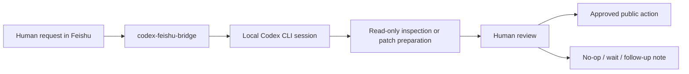

# Codex-Assisted OSS Maintenance Workflow

This document describes how `codex-feishu-bridge` fits into a practical open-source maintenance loop.

The bridge is intentionally small: it turns human-approved Feishu private-chat requests into local Codex CLI sessions, then returns Codex output to the same private chat. It is useful when OSS maintenance work needs quick triage, focused checks, or a durable handoff trail without turning every action into a public write.

## Workflow Loop



## What The Workflow Is Good For

- GitHub notification and PR-state monitoring.
- Pull request triage and review-thread summarization.
- CI failure summarization and focused repair proposals.
- Small documentation or code patch preparation.
- Release-readiness checklists.
- Evidence tracking that links work to public PRs, checks, and local verification commands.

## Human-Controlled Boundaries

The bridge does not remove human responsibility. These actions stay outside automation:

- signing CLAs or accepting legal terms;
- authorizing deployments;
- changing organization permissions;
- publishing comments, commits, tags, or releases without human approval;
- submitting applications, contracts, or account-bound confirmations.

## Typical Maintenance Session

1. A maintainer sends a private Feishu request such as `check PR #15482 status`.
2. The bridge routes the request into the current local Codex session.
3. Codex performs compact read-only inspection first: PR state, latest reviews, latest comments, and check summary.
4. If a patch is needed, Codex prepares the smallest reasonable local change and runs focused verification.
5. The human reviews the result before any public write action.
6. The final state is recorded in the evidence trail when it matters for future review.

## Evidence Example

The current public evidence page is:

- [Codex-assisted OSS maintenance evidence](./codex-oss-evidence.md)

It links the workflow to public PRs and the verification or boundary state observed for each one.

## Release Readiness For This Repository

Before publishing a release, verify:

```powershell
npm test
git status --short --branch
```

The `0.1.x` line should be treated as an early operational release: useful for a local maintainer workflow, but still intentionally narrow in scope.
